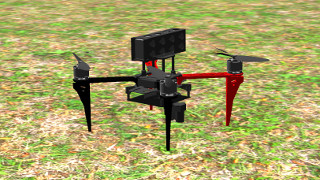
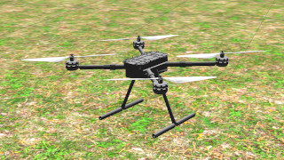

# MRS UAV Gazebo Simulation


Metapackage for the MRS UAV Gazebo simulation pipeline.

## Installation

1. Install the [MRS UAV System](https://github.com/ctu-mrs/mrs_uav_system#installation)
2. `sudo apt install ros-noetic-mrs-uav-gazebo-simulation`

## Submodules

| Package                     | Repository                                                                            |
|-----------------------------|---------------------------------------------------------------------------------------|
| MRS Gazebo Common Resources | [mrs_gazebo_common_resources](https://github.com/ctu-mrs/mrs_gazebo_common_resources) |
| PX4                         | [px4_firmware](https://github.com/ctu-mrs/px4_firmware)                               |
| PX4 SITL Gazebo             | [px4_sitl_gazebo](https://github.com/ctu-mrs/px4_sitl_gazebo)                         |

## Unmanned Aerial Vehicles

| Model         | Spawn argument | Simulation                    |
|---------------|----------------|-------------------------------|
| DJI f330      | `--f330`       |  |
| DJI f450      | `--f450`       |  |
| Holybro x500  | `--x500`       |  |
| DJI f550      | `--f550`       |  |
| Tarot t650    | `--t650`       |  |
| T-Drones m690 | `--m690`       |  |
| NAKI II       | `--naki`       |  |

## Starting the simulation

Use one of the prepared Tmuxinator sessions:

- [tmux/one_drone_gps](tmux/one_drone_gps)

## Customizing drone using the "spawner parameters"

**TODO** the wiki page [https://ctu-mrs.github.io/docs/simulation/drone_spawner.html](https://ctu-mrs.github.io/docs/simulation/drone_spawner.html) contains potentially duplicit or contradicting information.
These two pages should be merged and the information should be presented at only one of the locations.

The UAV platforms can be additionaly equipped with sensors (rangefinders, 2d lidars, stereo cameras etc.).

### Start of the Gazebo simulator

To start the prepared example of Gazebo world call:

```bash
roslaunch mrs_simulation simulation.launch world_file:='$(find mrs_gazebo_common)/worlds/grass_plane.world' gui:=true
```

At this point the Gazebo world will only contain the environment with grass plane but with no vehicles yet.

### Spawning of UAVs

The `simulation.launch` will automatically start the `mrs_drone_spawner` python node. If you use a custom launch file to start the simulation, you can start it separately:

```bash
roslaunch mrs_simulation mrs_drone_spawner.launch
```

The `mrs_drone_spawner` will perform the following tasks:

* Spawn vehicle models in the Gazebo simulation (ids from 0 to 250). This is done internally by calling the command `rosrun gazebo_ros spawn_model`.

* For each vehicle, PX4 firmware and mavros is started at specific port numbers depending on the vehicle ID.

Vehicles are added to the simulation by calling the `spawn` service of the `mrs_drone_spawner`.
The service takes one string argument, which specifies the vehicle ID, type and sensor configuration.
Example: spawn a single vehicle with a down-facing laser rangefinder:

```bash
rosservice call /mrs_drone_spawner/spawn "1 --enable-rangefinder"
```

To display the manual containing a list of all available arguments, perform a dry-run of the script:
```bash
rosrun mrs_simulation mrs_drone_spawner
```

The arguments are also listed in the `mrs_simulation/config/spawner_params.yaml` file.
Note that not all sensors are available for all the vehicle types.
The config file stores the available configurations in the following format: `parameter: [default_value, help_description, [compatible_vehicles]]`

Multiple vehicles may be spawned with one service call:
```bash
rosservice call /mrs_drone_spawner/spawn "1 2 3 4 5 --t650 --enable-bluefox-camera --enable-rangefinder"
```

Spawn position may be specified by a command line argument `--pos x y z heading`: [m, m, m, rad]
```bash
rosservice call /mrs_drone_spawner/spawn "1 --f550 --enable-rangefinder --pos 10 -15 0.3 0.7"
```
For multiple vehicles, `--pos` defines the spawn point of the first vehicle. Following vehicles will be spawned in a line, with an x-offset of 2 meters from the previous vehicle.

Spawn position may be specified by a `.csv` or a `.yaml` file using `--file absolute_path_to_file`:
```bash
rosservice call /mrs_drone_spawner/spawn "1 --f450 --enable-rangefinder --enable-ouster --use-gpu-ray --ouster-model OS1-64 --file `pwd`/spawn_poses.yaml"
```

Use a whitespace instead of an ID to get an available ID automatically assigned by the spawner.
```bash
rosservice call /mrs_drone_spawner/spawn " --f450 --enable-rangefinder"
```
